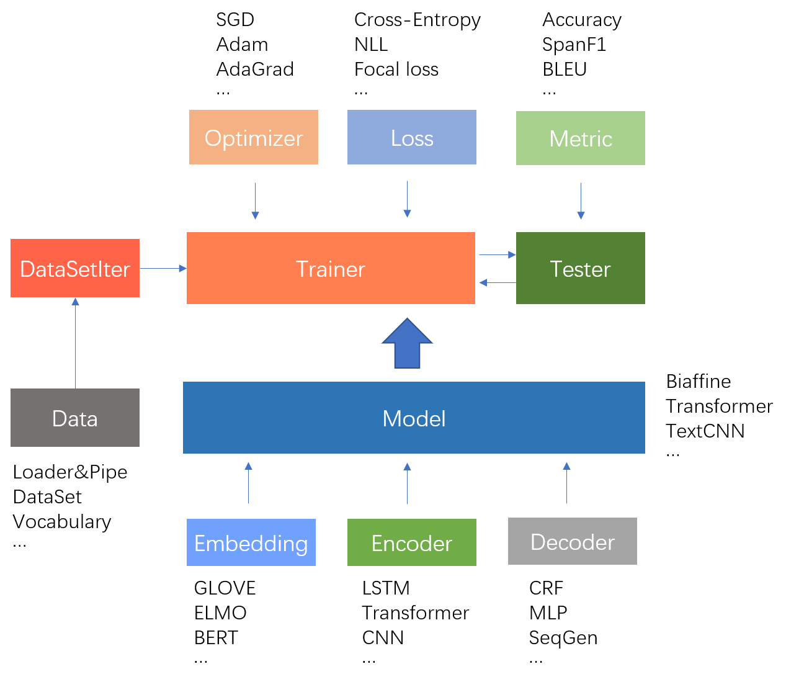

# fastNLP

[](https://travis-ci.org/fastnlp/fastNLP)
[](https://codecov.io/gh/fastnlp/fastNLP)
[](https://pypi.org/project/fastNLP)

[](http://fastnlp.readthedocs.io/?badge=latest)

fastNLP 是一款轻量级的 NLP 工具包。你既可以使用它快速地完成一个序列标注（[NER](reproduction/sequence_labelling/ner)、POS-Tagging等）、中文分词、[文本分类](reproduction/text_classification)、[Matching](reproduction/matching)、[指代消解](reproduction/coreference_resolution)、[摘要](reproduction/Summarization)等任务； 也可以使用它快速构建许多复杂的网络模型，进行科研。它具有如下的特性：

- 统一的Tabular式数据容器，让数据预处理过程简洁明了。内置多种数据集的Loader和Pipe，省去预处理代码;
- 多种训练、测试组件，例如训练器Trainer；测试器Tester；以及各种评测metrics等等;
- 各种方便的NLP工具，例如预处理embedding加载（包括ELMo和BERT）; 中间数据cache等;
- 部分[数据集与预训练模型](https://docs.qq.com/sheet/DVnpkTnF6VW9UeXdh?c=A1A0A0)的自动下载
- 详尽的中文[文档](https://fastnlp.readthedocs.io/)、[教程](https://fastnlp.readthedocs.io/zh/latest/user/tutorials.html)以供查阅;
- 提供诸多高级模块，例如Variational LSTM, Transformer, CRF等;
- 在序列标注、中文分词、文本分类、Matching、指代消解、摘要等任务上封装了各种模型可供直接使用，详细内容见 [reproduction](reproduction) 部分;
- 便捷且具有扩展性的训练器; 提供多种内置callback函数，方便实验记录、异常捕获等。


## 安装指南

fastNLP 依赖以下包:

+ numpy>=1.14.2
+ torch>=1.0.0
+ tqdm>=4.28.1
+ nltk>=3.4.1
+ requests
+ spacy
+ prettytable>=0.7.2

其中torch的安装可能与操作系统及 CUDA 的版本相关，请参见 [PyTorch 官网](https://pytorch.org/) 。 
在依赖包安装完成后，您可以在命令行执行如下指令完成安装

```shell
pip install fastNLP
python -m spacy download en
```


## fastNLP教程

### 快速入门

- [0. 快速入门](https://fastnlp.readthedocs.io/zh/latest/user/quickstart.html)

### 详细使用教程

- [1. 使用DataSet预处理文本](https://fastnlp.readthedocs.io/zh/latest/tutorials/tutorial_1_data_preprocess.html)
- [2. 使用Vocabulary转换文本与index](https://fastnlp.readthedocs.io/zh/latest/tutorials/tutorial_2_vocabulary.html)
- [3. 使用Embedding模块将文本转成向量](https://fastnlp.readthedocs.io/zh/latest/tutorials/tutorial_3_embedding.html)
- [4. 使用Loader和Pipe加载并处理数据集](https://fastnlp.readthedocs.io/zh/latest/tutorials/tutorial_4_load_dataset.html)
- [5. 动手实现一个文本分类器I-使用Trainer和Tester快速训练和测试](https://fastnlp.readthedocs.io/zh/latest/tutorials/tutorial_5_loss_optimizer.html)
- [6. 动手实现一个文本分类器II-使用DataSetIter实现自定义训练过程](https://fastnlp.readthedocs.io/zh/latest/tutorials/tutorial_6_datasetiter.html)
- [7. 使用Metric快速评测你的模型](https://fastnlp.readthedocs.io/zh/latest/tutorials/tutorial_7_metrics.html)
- [8. 使用Modules和Models快速搭建自定义模型](https://fastnlp.readthedocs.io/zh/latest/tutorials/tutorial_8_modules_models.html)
- [9. 快速实现序列标注模型](https://fastnlp.readthedocs.io/zh/latest/tutorials/tutorial_9_seq_labeling.html)
- [10. 使用Callback自定义你的训练过程](https://fastnlp.readthedocs.io/zh/latest/tutorials/tutorial_10_callback.html)

### 扩展教程

- [Extend-1. BertEmbedding的各种用法](https://fastnlp.readthedocs.io/zh/latest/tutorials/extend_1_bert_embedding.html)
- [Extend-2. 使用fitlog 辅助 fastNLP 进行科研](https://fastnlp.readthedocs.io/zh/latest/tutorials/extend_2_fitlog.html)


## 内置组件

大部分用于的 NLP 任务神经网络都可以看做由词嵌入（embeddings）和两种模块：编码器（encoder）、解码器（decoder）组成。

以文本分类任务为例，下图展示了一个BiLSTM+Attention实现文本分类器的模型流程图：


fastNLP 在 embeddings 模块中内置了几种不同的embedding：静态embedding（GloVe、word2vec）、上下文相关embedding
（ELMo、BERT）、字符embedding（基于CNN或者LSTM的CharEmbedding）

与此同时，fastNLP 在 modules 模块中内置了两种模块的诸多组件，可以帮助用户快速搭建自己所需的网络。 两种模块的功能和常见组件如下:

<table>
<tr>
    <td><b> 类型 </b></td>
    <td><b> 功能 </b></td>
    <td><b> 例子 </b></td>
</tr>
<tr>
    <td> encoder </td>
    <td> 将输入编码为具有具有表示能力的向量 </td>
    <td> Embedding, RNN, CNN, Transformer, ...
</tr>
<tr>
    <td> decoder </td>
    <td> 将具有某种表示意义的向量解码为需要的输出形式 </td>
    <td> MLP, CRF, ... </td>
</tr>
</table>


## 项目结构



fastNLP的大致工作流程如上图所示，而项目结构如下：

<table>
<tr>
    <td><b> fastNLP </b></td>
    <td> 开源的自然语言处理库 </td>
</tr>
<tr>
    <td><b> fastNLP.core </b></td>
    <td> 实现了核心功能，包括数据处理组件、训练器、测试器等 </td>
</tr>
<tr>
    <td><b> fastNLP.models </b></td>
    <td> 实现了一些完整的神经网络模型 </td>
</tr>
<tr>
    <td><b> fastNLP.modules </b></td>
    <td> 实现了用于搭建神经网络模型的诸多组件 </td>
</tr>
<tr>
    <td><b> fastNLP.embeddings </b></td>
    <td> 实现了将序列index转为向量序列的功能，包括读取预训练embedding等 </td>
</tr>
<tr>
    <td><b> fastNLP.io </b></td>
    <td> 实现了读写功能，包括数据读入与预处理，模型读写，数据与模型自动下载等 </td>
</tr>
</table>

<hr>

*In memory of @FengZiYjun.  May his soul rest in peace. We will miss you very very much!*
