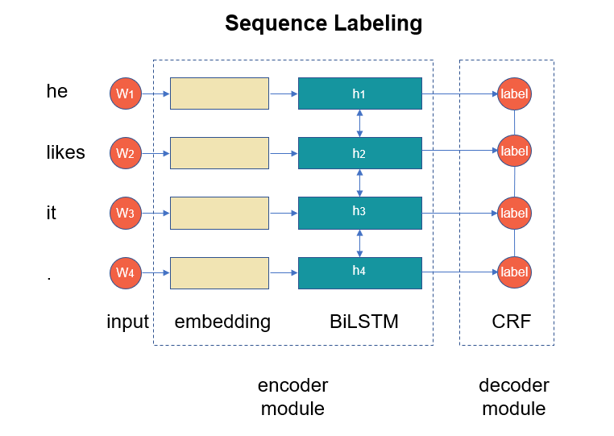

fastNLP documentation
=====================
fastNLP，目前仍在孵化中。

Introduction
------------

fastNLP是一个基于PyTorch的模块化自然语言处理系统，用于快速开发NLP工具。 
它将基于深度学习的NLP模型划分为不同的模块。 
这些模块分为4类：encoder（编码），interaction（交互）, aggregration（聚合） and decoder（解码），
而每个类别包含不同的实现模块。 

大多数当前的NLP模型可以构建在这些模块上，这极大地简化了开发NLP模型的过程。 
fastNLP的架构如图所示：

在constructing model部分，以序列标注和文本分类为例进行说明：

.. image:: figures/text_classification.png

* encoder module：将输入编码为一些抽象表示，输入的是单词序列，输出向量序列。
* interaction module：使表示中的信息相互交互，输入的是向量序列，输出的也是向量序列。
* aggregation module：聚合和减少信息，输入向量序列，输出一个向量。
* decoder module：将表示解码为输出，输出一个label（文本分类）或者输出label序列（序列标注）

其中interaction module和aggregation module在模型中不一定存在，例如上面的序列标注模型。

User's Guide
------------
.. toctree::
   :maxdepth: 2

   user/installation
   user/quickstart

API Reference
-------------

If you are looking for information on a specific function, class or
method, this part of the documentation is for you.

.. toctree::
   :maxdepth: 2
   
   fastNLP API <fastNLP>

Indices and tables
==================

* :ref:`genindex`
* :ref:`modindex`
* :ref:`search`
