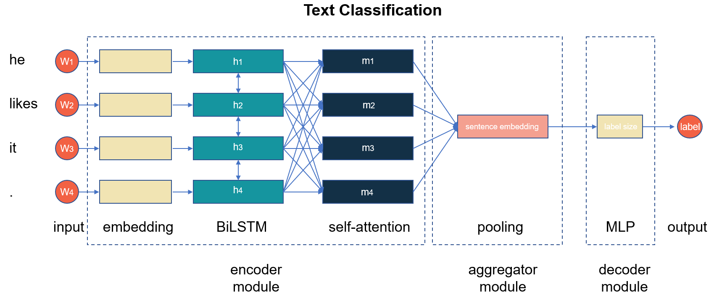

fastNLP 中文文档
=====================

fastNLP 是一款轻量级的 NLP 处理套件。你既可以使用它快速地完成一个命名实体识别（NER）、中文分词或文本分类任务；
也可以使用他构建许多复杂的网络模型，进行科研。它具有如下的特性:

- 统一的Tabular式数据容器，让数据预处理过程简洁明了。内置多种数据集的DataSet Loader，省去预处理代码。
- 各种方便的NLP工具，例如预处理embedding加载; 中间数据cache等;
- 详尽的中文文档以供查阅；
- 提供诸多高级模块，例如Variational LSTM, Transformer, CRF等;
- 封装CNNText，Biaffine等模型可供直接使用;
- 便捷且具有扩展性的训练器; 提供多种内置callback函数，方便实验记录、异常捕获等。

内置组件
------------

大部分用于的 NLP 任务神经网络都可以看做由编码（encoder）、聚合（aggregator）、解码（decoder）三种模块组成。

fastNLP 在 :mod:`~fastNLP.modules` 模块中内置了三种模块的诸多组件，可以帮助用户快速搭建自己所需的网络。
三种模块的功能和常见组件如下:

+-----------------------+-----------------------+-----------------------+
| module type           | functionality         | example               |
+=======================+=======================+=======================+
| encoder               | 将输入编码为具有具    | embedding, RNN, CNN,  |
|                       | 有表示能力的向量      | transformer           |
+-----------------------+-----------------------+-----------------------+
| aggregator            | 从多个向量中聚合信息  | self-attention,       |
|                       |                       | max-pooling           |
+-----------------------+-----------------------+-----------------------+
| decoder               | 将具有某种表示意义的  | MLP, CRF              |
|                       | 向量解码为需要的输出  |                       |
|                       | 形式                  |                       |
+-----------------------+-----------------------+-----------------------+

内置模型
----------------

fastNLP 在 :mod:`~fastNLP.models` 模块中内置了如 :class:`~fastNLP.models.CNNText` 、
:class:`~fastNLP.models.SeqLabeling` 等完整的模型，以供用户直接使用。

.. todo::
    这些模型的介绍如下表所示：（模型名称 + 介绍 + 任务上的结果）

用户手册
----------------

.. toctree::
   :maxdepth: 1

    安装指南 </user/installation>
    快速入门 </user/quickstart>
    详细指南 </user/tutorials>
    科研指南 </user/with_fitlog>

API 文档
-------------

除了用户手册之外，你还可以通过查阅 API 文档来找到你所需要的工具。

.. toctree::
   :titlesonly:
   :maxdepth: 2
   
   fastNLP

fitlog
------

用户可以 `点此 <https://fitlog.readthedocs.io/zh/latest/>`_  查看fitlog的文档。
fitlog 是由我们团队开发，用于帮助用户记录日志并管理代码的工具

索引与搜索
==================

* :ref:`genindex`
* :ref:`modindex`
* :ref:`search`
