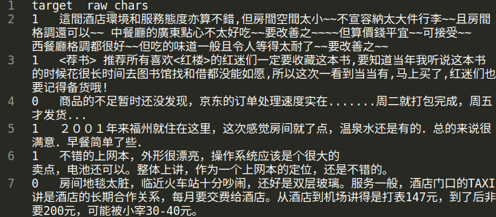

文本分类
=============================

文本分类(Text classification)任务是将一句话或一段话划分到某个具体的类别。比如垃圾邮件识别，文本情绪分类等。这篇教程可以带你从零开始了解 fastNLP 的使用

.. note::

    本教程推荐使用 GPU 进行实验

.. code-block:: text

    1, 商务大床房，房间很大，床有2M宽，整体感觉经济实惠不错!

其中开头的1是只这条评论的标签，表示是正面的情绪。我们将使用到的数据可以通过 `此链接 <http://download.fastnlp.top/dataset/chn_senti_corp.zip>`_
下载并解压，当然也可以通过fastNLP自动下载该数据。

数据中的内容如下图所示。接下来，我们将用fastNLP在这个数据上训练一个分类网络。

步骤
----

一共有以下的几个步骤:

1. `读取数据 <#id4>`_

2. `预处理数据 <#id5>`_

3. `选择预训练词向量 <#id6>`_

4. `创建模型 <#id7>`_

5. `训练模型 <#id8>`_

(1) 读取数据
~~~~~~~~~~~~~~~~~~~~

fastNLP提供多种数据的自动下载与自动加载功能，对于这里我们要用到的数据，我们可以用 :class:`~fastNLP.io.Loader` 自动下载并加载该数据。
更多有关Loader的使用可以参考 :mod:`~fastNLP.io.loader`

.. code-block:: python

    from fastNLP.io import ChnSentiCorpLoader
    
    loader = ChnSentiCorpLoader()        # 初始化一个中文情感分类的loader
    data_dir = loader.download()         # 这一行代码将自动下载数据到默认的缓存地址, 并将该地址返回
    data_bundle = loader.load(data_dir)  # 这一行代码将从{data_dir}处读取数据至DataBundle

DataBundle的相关介绍，可以参考 :class:`~fastNLP.io.DataBundle` 。我们可以打印该data\_bundle的基本信息。

.. code-block:: python

    print(data_bundle)

.. code-block:: text

    In total 3 datasets:
        dev has 1200 instances.
        train has 9600 instances.
        test has 1200 instances.
    In total 0 vocabs:
    

可以看出，该data\_bundle中一个含有三个 :class:`~fastNLP.DataSet` 。通过下面的代码，我们可以查看DataSet的基本情况

.. code-block:: python

    print(data_bundle.get_dataset('train')[:2])  # 查看Train集前两个sample

.. code-block:: text

    +-----------------------------+--------+
    | raw_chars                   | target |
    +-----------------------------+--------+
    | 选择珠江花园的原因就是方...    | 1      |
    | 15.4寸笔记本的键盘确实爽...    | 1      |
    +-----------------------------+--------+

(2) 预处理数据
~~~~~~~~~~~~~~~~~~~~

在NLP任务中，预处理一般包括:

(a) 将一整句话切分成汉字或者词;

(b) 将文本转换为index

fastNLP中也提供了多种数据集的处理类，这里我们直接使用fastNLP的ChnSentiCorpPipe。更多关于Pipe的说明可以参考 :mod:`~fastNLP.io.pipe` 。

.. code-block:: python

    from fastNLP.io import ChnSentiCorpPipe

    pipe = ChnSentiCorpPipe()
    data_bundle = pipe.process(data_bundle)  # 所有的Pipe都实现了process()方法，且输入输出都为DataBundle类型

    print(data_bundle)  # 打印data_bundle，查看其变化

.. code-block:: text

    In total 3 datasets:
        dev has 1200 instances.
        train has 9600 instances.
        test has 1200 instances.
    In total 2 vocabs:
        chars has 4409 entries.
        target has 2 entries.

可以看到除了之前已经包含的3个 :class:`~fastNLP.DataSet` ,还新增了两个 :class:`~fastNLP.Vocabulary` 。我们可以打印DataSet中的内容

.. code-block:: python

    print(data_bundle.get_dataset('train')[:2])

.. code-block:: text

    +-----------------+--------+-----------------+---------+
    | raw_chars       | target | chars           | seq_len |
    +-----------------+--------+-----------------+---------+
    | 选择珠江花园... | 0      | [338, 464, 1... | 106     |
    | 15.4寸笔记本... | 0      | [50, 133, 20... | 56      |
    +-----------------+--------+-----------------+---------+

新增了一列为数字列表的chars，以及变为数字的target列。可以看出这两列的名称和刚好与data\_bundle中两个Vocabulary的名称是一致的，我们可以打印一下Vocabulary看一下里面的内容。

.. code-block:: python

    char_vocab = data_bundle.get_vocab('chars')
    print(char_vocab)

.. code-block:: text

    Vocabulary(['选', '择', '珠', '江', '花']...)

Vocabulary是一个记录着词语与index之间映射关系的类，比如

.. code-block:: python

    index = char_vocab.to_index('选')
    print("'选'的index是{}".format(index))  # 这个值与上面打印出来的第一个instance的chars的第一个index是一致的
    print("index:{}对应的汉字是{}".format(index, char_vocab.to_word(index)))

.. code-block:: text

    '选'的index是338
    index:338对应的汉字是选

(3) 选择预训练词向量
~~~~~~~~~~~~~~~~~~~~

由于Word2vec, Glove, Elmo, Bert等预训练模型可以增强模型的性能，所以在训练具体任务前，选择合适的预训练词向量非常重要。
在fastNLP中我们提供了多种Embedding使得加载这些预训练模型的过程变得更加便捷。
这里我们先给出一个使用word2vec的中文汉字预训练的示例，之后再给出一个使用Bert的文本分类。
这里使用的预训练词向量为'cn-fastnlp-100d'，fastNLP将自动下载该embedding至本地缓存，
fastNLP支持使用名字指定的Embedding以及相关说明可以参见 :mod:`fastNLP.embeddings`

.. code-block:: python

    from fastNLP.embeddings import StaticEmbedding

    word2vec_embed = StaticEmbedding(char_vocab, model_dir_or_name='cn-char-fastnlp-100d')

.. code-block:: text

    Found 4321 out of 4409 compound in the pre-training embedding.

(4) 创建模型
~~~~~~~~~~~~

.. code-block:: python

    from torch import nn
    from fastNLP.modules import LSTM
    import torch
    
    # 定义模型
    class BiLSTMMaxPoolCls(nn.Module):
        def __init__(self, embed, num_classes, hidden_size=400, num_layers=1, dropout=0.3):
            super().__init__()
            self.embed = embed
            
            self.lstm = LSTM(self.embed.embedding_dim, hidden_size=hidden_size//2, num_layers=num_layers, 
                             batch_first=True, bidirectional=True)
            self.dropout_layer = nn.Dropout(dropout)
            self.fc = nn.Linear(hidden_size, num_classes)
            
        def forward(self, chars, seq_len):  # 这里的名称必须和DataSet中相应的field对应，比如之前我们DataSet中有chars，这里就必须为chars
            # chars:[batch_size, max_len]
            # seq_len: [batch_size, ]
            chars = self.embed(chars)
            outputs, _ = self.lstm(chars, seq_len)
            outputs = self.dropout_layer(outputs)
            outputs, _ = torch.max(outputs, dim=1)
            outputs = self.fc(outputs)
            
            return {'pred':outputs}  # [batch_size,], 返回值必须是dict类型，且预测值的key建议设为pred
    
    # 初始化模型
    model = BiLSTMMaxPoolCls(word2vec_embed, len(data_bundle.get_vocab('target')))

(5) 训练模型
~~~~~~~~~~~~

fastNLP提供了Trainer对象来组织训练过程，包括完成loss计算(所以在初始化Trainer的时候需要指定loss类型)，梯度更新(所以在初始化Trainer的时候需要提供优化器optimizer)以及在验证集上的性能验证(所以在初始化时需要提供一个Metric)

.. code-block:: python

    from fastNLP import Trainer
    from fastNLP import CrossEntropyLoss
    from torch.optim import Adam
    from fastNLP import AccuracyMetric
    
    loss = CrossEntropyLoss()
    optimizer = Adam(model.parameters(), lr=0.001)
    metric = AccuracyMetric()
    device = 0 if torch.cuda.is_available() else 'cpu'  # 如果有gpu的话在gpu上运行，训练速度会更快
    
    trainer = Trainer(train_data=data_bundle.get_dataset('train'), model=model, loss=loss, 
                      optimizer=optimizer, batch_size=32, dev_data=data_bundle.get_dataset('dev'),
                      metrics=metric, device=device)
    trainer.train()  # 开始训练，训练完成之后默认会加载在dev上表现最好的模型
    
    # 在测试集上测试一下模型的性能
    from fastNLP import Tester
    print("Performance on test is:")
    tester = Tester(data=data_bundle.get_dataset('test'), model=model, metrics=metric, batch_size=64, device=device)
    tester.test()

.. code-block:: text

    input fields after batch(if batch size is 2):
        target: (1)type:torch.Tensor (2)dtype:torch.int64, (3)shape:torch.Size([2]) 
        chars: (1)type:torch.Tensor (2)dtype:torch.int64, (3)shape:torch.Size([2, 106]) 
        seq_len: (1)type:torch.Tensor (2)dtype:torch.int64, (3)shape:torch.Size([2]) 
    target fields after batch(if batch size is 2):
        target: (1)type:torch.Tensor (2)dtype:torch.int64, (3)shape:torch.Size([2]) 
        seq_len: (1)type:torch.Tensor (2)dtype:torch.int64, (3)shape:torch.Size([2]) 
    
    Evaluate data in 0.01 seconds!
    training epochs started 2019-09-03-23-57-10

    Evaluate data in 0.43 seconds!
    Evaluation on dev at Epoch 1/10. Step:300/3000: 
    AccuracyMetric: acc=0.81

    Evaluate data in 0.44 seconds!
    Evaluation on dev at Epoch 2/10. Step:600/3000: 
    AccuracyMetric: acc=0.8675

    Evaluate data in 0.44 seconds!
    Evaluation on dev at Epoch 3/10. Step:900/3000:
    AccuracyMetric: acc=0.878333

    ....

    Evaluate data in 0.48 seconds!
    Evaluation on dev at Epoch 9/10. Step:2700/3000: 
    AccuracyMetric: acc=0.8875

    Evaluate data in 0.43 seconds!
    Evaluation on dev at Epoch 10/10. Step:3000/3000: 
    AccuracyMetric: acc=0.895833
     
    In Epoch:7/Step:2100, got best dev performance:
    AccuracyMetric: acc=0.8975
    Reloaded the best model.

    Evaluate data in 0.34 seconds!
    [tester] 
    AccuracyMetric: acc=0.8975

    {'AccuracyMetric': {'acc': 0.8975}}

PS: 使用Bert进行文本分类
~~~~~~~~~~~~~~~~~~~~

.. code-block:: python

    # 只需要切换一下Embedding即可
    from fastNLP.embeddings import BertEmbedding
    
    # 这里为了演示一下效果，所以默认Bert不更新权重
    bert_embed = BertEmbedding(char_vocab, model_dir_or_name='cn', auto_truncate=True, requires_grad=False)
    model = BiLSTMMaxPoolCls(bert_embed, len(data_bundle.get_vocab('target')))
    
    
    import torch
    from fastNLP import Trainer
    from fastNLP import CrossEntropyLoss
    from torch.optim import Adam
    from fastNLP import AccuracyMetric
    
    loss = CrossEntropyLoss()
    optimizer = Adam(model.parameters(), lr=2e-5)
    metric = AccuracyMetric()
    device = 0 if torch.cuda.is_available() else 'cpu'  # 如果有gpu的话在gpu上运行，训练速度会更快
    
    trainer = Trainer(train_data=data_bundle.get_dataset('train'), model=model, loss=loss, 
                      optimizer=optimizer, batch_size=16, dev_data=data_bundle.get_dataset('test'),
                      metrics=metric, device=device, n_epochs=3)
    trainer.train()  # 开始训练，训练完成之后默认会加载在dev上表现最好的模型
    
    # 在测试集上测试一下模型的性能
    from fastNLP import Tester
    print("Performance on test is:")
    tester = Tester(data=data_bundle.get_dataset('test'), model=model, metrics=metric, batch_size=64, device=device)
    tester.test()

.. code-block:: text

    loading vocabulary file ~/.fastNLP/embedding/bert-chinese-wwm/vocab.txt
    Load pre-trained BERT parameters from file ~/.fastNLP/embedding/bert-chinese-wwm/chinese_wwm_pytorch.bin.
    Start to generating word pieces for word.
    Found(Or segment into word pieces) 4286 words out of 4409.
    input fields after batch(if batch size is 2):
        target: (1)type:torch.Tensor (2)dtype:torch.int64, (3)shape:torch.Size([2]) 
        chars: (1)type:torch.Tensor (2)dtype:torch.int64, (3)shape:torch.Size([2, 106]) 
        seq_len: (1)type:torch.Tensor (2)dtype:torch.int64, (3)shape:torch.Size([2]) 
    target fields after batch(if batch size is 2):
        target: (1)type:torch.Tensor (2)dtype:torch.int64, (3)shape:torch.Size([2]) 
        seq_len: (1)type:torch.Tensor (2)dtype:torch.int64, (3)shape:torch.Size([2]) 
    
    Evaluate data in 0.05 seconds!
    training epochs started 2019-09-04-00-02-37

    Evaluate data in 15.89 seconds!
    Evaluation on dev at Epoch 1/3. Step:1200/3600: 
    AccuracyMetric: acc=0.9

    Evaluate data in 15.92 seconds!
    Evaluation on dev at Epoch 2/3. Step:2400/3600: 
    AccuracyMetric: acc=0.904167

    Evaluate data in 15.91 seconds!
    Evaluation on dev at Epoch 3/3. Step:3600/3600: 
    AccuracyMetric: acc=0.918333

    In Epoch:3/Step:3600, got best dev performance:
    AccuracyMetric: acc=0.918333
    Reloaded the best model.
    Performance on test is:

    Evaluate data in 29.24 seconds!
    [tester] 
    AccuracyMetric: acc=0.919167

    {'AccuracyMetric': {'acc': 0.919167}}

PS: 基于词进行文本分类
~~~~~~~~~~~~~~~~~~~~

由于汉字中没有显示的字与字的边界，一般需要通过分词器先将句子进行分词操作。
下面的例子演示了如何不基于fastNLP已有的数据读取、预处理代码进行文本分类。

(1) 读取数据
~~~~~~~~~~~~~~~~~~~~

这里我们继续以之前的数据为例，但这次我们不使用fastNLP自带的数据读取代码

.. code-block:: python

    from fastNLP.io import ChnSentiCorpLoader
    
    loader = ChnSentiCorpLoader()        # 初始化一个中文情感分类的loader
    data_dir = loader.download()         # 这一行代码将自动下载数据到默认的缓存地址, 并将该地址返回

获取到的data_dir下应该有类似以下的文件

.. code-block:: text

    - chn_senti_corp
        - train.tsv
        - dev.tsv
        - test.tsv

如果打开任何一个文件查看，会发现里面的格式均为

.. code-block:: text

    target  raw_chars
    1       这个宾馆比较陈旧了，特价的房间也很一般。总体来说一般
    0       怀着十分激动的心情放映...

下面我们先定义一个read_file_to_dataset的函数, 即给定一个文件路径，读取其中的内容，并返回一个DataSet。然后我们将所有的DataSet放入到DataBundle对象中来方便接下来的预处理

.. code-block:: python

    import os
    from fastNLP import DataSet, Instance
    from fastNLP.io import DataBundle

    def read_file_to_dataset(fp):
        ds = DataSet()
        with open(fp, 'r') as f:
            f.readline()  # 第一行是title名称，忽略掉
            for line in f:
                line = line.strip()
                target, chars = line.split('\t')
                ins = Instance(target=target, raw_chars=chars)
                ds.append(ins)
        return ds

    data_bundle = DataBundle()
    for name in ['train.tsv', 'dev.tsv', 'test.tsv']:
        fp = os.path.join(data_dir, name)
        ds = read_file_to_dataset(fp)
        data_bundle.set_dataset(name=name.split('.')[0], dataset=ds)

    print(data_bundle)  # 查看以下数据集的情况
    # In total 3 datasets:
    #    train has 9600 instances.
    #    dev has 1200 instances.
    #    test has 1200 instances.

(2) 数据预处理
~~~~~~~~~~~~~~~~~~~~

在这里，我们首先把句子通过 fastHan_ 进行分词操作，然后创建词表，并将词语转换为序号。

.. _fastHan: https://gitee.com/fastnlp/fastHan

.. code-block:: python

    from fastHan import FastHan
    from fastNLP import Vocabulary

    model=FastHan()

    # 定义分词处理操作
    def word_seg(ins):
        raw_chars = ins['raw_chars']
        # 由于有些句子比较长，我们只截取前128个汉字
        raw_words = model(raw_chars[:128], target='CWS')[0]
        return raw_words

    for name, ds in data_bundle.iter_datasets():
        # apply函数将对内部的instance依次执行word_seg操作，并把其返回值放入到raw_words这个field
        ds.apply(word_seg, new_field_name='raw_words')
        # 除了apply函数，fastNLP还支持apply_field, apply_more(可同时创建多个field)等操作

    vocab = Vocabulary()

    # 对raw_words列创建词表, 建议把非训练集的dataset放在no_create_entry_dataset参数中
    # 也可以通过add_word(), add_word_lst()等建立词表，请参考http://www.fastnlp.top/docs/fastNLP/tutorials/tutorial_2_vocabulary.html
    vocab.from_dataset(data_bundle.get_dataset('train'), field_name='raw_words', 
                    no_create_entry_dataset=[data_bundle.get_dataset('dev'), 
                                                data_bundle.get_dataset('test')]) 

    # 将建立好词表的Vocabulary用于对raw_words列建立词表，并把转为序号的列存入到words列
    vocab.index_dataset(data_bundle.get_dataset('train'), data_bundle.get_dataset('dev'), 
                    data_bundle.get_dataset('test'), field_name='raw_words', new_field_name='words')

    # 建立target的词表，target的词表一般不需要padding和unknown
    target_vocab = Vocabulary(padding=None, unknown=None) 
    # 一般情况下我们可以只用训练集建立target的词表
    target_vocab.from_dataset(data_bundle.get_dataset('train'), field_name='target') 
    # 如果没有传递new_field_name, 则默认覆盖原词表
    target_vocab.index_dataset(data_bundle.get_dataset('train'), data_bundle.get_dataset('dev'), 
                    data_bundle.get_dataset('test'), field_name='target')

    # 我们可以把词表保存到data_bundle中，方便之后使用
    data_bundle.set_vocab(field_name='words', vocab=vocab)
    data_bundle.set_vocab(field_name='target', vocab=target_vocab)

    # 我们把words和target分别设置为input和target，这样它们才会在训练循环中被取出并自动padding, 有关这部分更多的内容参考
    #  http://www.fastnlp.top/docs/fastNLP/tutorials/tutorial_6_datasetiter.html
    data_bundle.set_target('target')
    data_bundle.set_input('words')  # DataSet也有这两个接口
    # 如果某些field，您希望它被设置为target或者input，但是不希望fastNLP自动padding或需要使用特定的padding方式，请参考
    #  http://www.fastnlp.top/docs/fastNLP/fastNLP.core.dataset.html

    print(data_bundle.get_dataset('train')[:2])  # 我们可以看一下当前dataset的内容

    # +--------+-----------------------+-----------------------+----------------------+
    # | target | raw_chars             | raw_words             | words                |
    # +--------+-----------------------+-----------------------+----------------------+
    # | 0      | 选择珠江花园的原因... | ['选择', '珠江', ...  | [2, 3, 4, 5, 6, 7... |
    # | 0      | 15.4寸笔记本的键盘... | ['15.4', '寸', '笔... | [71, 72, 73, 74, ... |
    # +--------+-----------------------+-----------------------+----------------------+

我们可以打印一下vocab看一下当前的词表内容

.. code-block:: python

    print(data_bundle.get_vocab('words'))
    # Vocabulary([选择, 珠江, 花园, 的, 原因]...)

(3) 选择预训练词向量
~~~~~~~~~~~~~~~~~~~~

这里我们选择腾讯的预训练中文词向量，可以在 腾讯词向量_ 处下载并解压。这里我们不能直接使用BERT，因为BERT是基于中文字进行预训练的。

.. _腾讯词向量: https://ai.tencent.com/ailab/nlp/en/embedding.html

下面我们使用 :mod:`fastNLP.embeddings` 加载该词向量，fastNLP会抽取vocabulary中包含的词的向量，并随机初始化不包含在文件中的词语的词向量。

.. code-block:: python

        from fastNLP.embeddings import StaticEmbedding

        word2vec_embed = StaticEmbedding(data_bundle.get_vocab('words'), model_dir_or_name='/path/to/Tencent_AILab_ChineseEmbedding.txt')

再之后的模型定义与训练过程与上面是一致的，这里就不再赘述了。

----------------------------------
代码下载
----------------------------------

.. raw:: html

    <a href="../_static/notebooks/%E6%96%87%E6%9C%AC%E5%88%86%E7%B1%BB.ipynb" download="文本分类.ipynb">点击下载 IPython Notebook 文件 </a>

