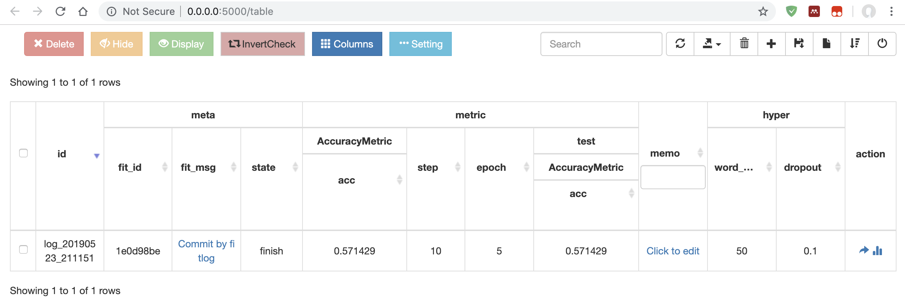
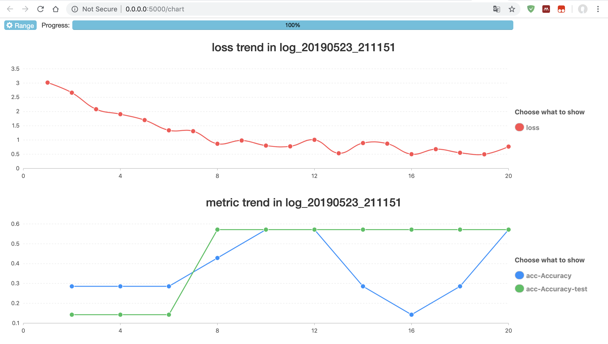

=================
科研向导
=================

本文介绍结合使用 fastNLP 和 fitlog 进行科研的方法。

首先，我们需要安装 `fitlog <https://fitlog.readthedocs.io/>`_ 。你需要确认你的电脑中没有其它名为 `fitlog` 的命令。

我们从命令行中进入到一个文件夹，现在我们要在文件夹中创建我们的 fastNLP 项目。你可以在命令行输入 `fitlog init test1` ，
然后你会看到如下提示::

    Initialized empty Git repository in /Users/fdujyn/workspaces/test1/.git/
    Auto commit by fitlog
    Initialized empty Git repository in /Users/fdujyn/workspaces/test1/.git/
    Fitlog project test1 is initialized.

这表明你已经创建成功了项目文件夹，并且在项目文件夹中已经初始化了 Git。如果你不想初始化 Git，
可以参考文档 `命令行工具 <https://fitlog.readthedocs.io/zh/latest/user/command_line.html>`_

现在我们进入你创建的项目文件夹 test1 中，可以看到有一个名为 logs 的文件夹，后面我们将会在里面存放你的实验记录。
同时也有一个名为 main.py 的文件，这是我们推荐你使用的训练入口文件。文件的内容如下::

    import fitlog

    fitlog.commit(__file__)             # auto commit your codes
    fitlog.add_hyper_in_file (__file__) # record your hyperparameters

    """
    Your training code here, you may use these functions to log your result:
        fitlog.add_hyper()
        fitlog.add_loss()
        fitlog.add_metric()
        fitlog.add_best_metric()
        ......
    """

    fitlog.finish()                     # finish the logging

我们推荐你保留除注释外的四行代码，它们有助于你的实验，
他们的具体用处参见文档 `用户 API <https://fitlog.readthedocs.io/zh/latest/fitlog.html>`_

我们假定你要进行前两个教程中的实验，并已经把数据复制到了项目根目录下的 tutorial_sample_dataset.csv 文件中。
现在我们编写如下的训练代码，使用 :class:`~fastNLP.core.callback.FitlogCallback` 进行实验记录保存::

    import fitlog
    from fastNLP import Vocabulary, Trainer, CrossEntropyLoss, AccuracyMetric
    from fastNLP.io import CSVLoader
    from fastNLP.models import CNNText
    from fastNLP.core.callback import FitlogCallback

    fitlog.commit(__file__)             # auto commit your codes
    fitlog.add_hyper_in_file (__file__) # record your hyperparameters

    ############hyper
    word_embed = 50
    dropout = 0.1
    ############hyper

    loader = CSVLoader(headers=('raw_sentence', 'label'), sep='\t')
    dataset = loader.load("tutorial_sample_dataset.csv")

    dataset.apply(lambda x: x['raw_sentence'].lower(), new_field_name='sentence')
    dataset.apply(lambda x: x['sentence'].split(), new_field_name='words', is_input=True)
    dataset.apply(lambda x: int(x['label']), new_field_name='target', is_target=True)
    vocab = Vocabulary(min_freq=2).from_dataset(dataset, field_name='words')
    vocab.index_dataset(dataset, field_name='words',new_field_name='words')

    model = CNNText((len(vocab),word_embed), num_classes=5, padding=2, dropout=dropout)

    train_dev_data, test_data = dataset.split(0.1)
    train_data, dev_data = train_dev_data.split(0.1)

    trainer = Trainer(model=model, train_data=train_data, dev_data=dev_data,
                      loss=CrossEntropyLoss(), metrics=AccuracyMetric(),
                      callbacks=[FitlogCallback(test_data)])
    trainer.train()

    fitlog.finish()                     # finish the logging

用命令行在项目目录下执行 `python main.py` 之后，输出结果如下::

    Auto commit by fitlog
    input fields after batch(if batch size is 2):
        words: (1)type:torch.Tensor (2)dtype:torch.int64, (3)shape:torch.Size([2, 11])
    target fields after batch(if batch size is 2):
        target: (1)type:torch.Tensor (2)dtype:torch.int64, (3)shape:torch.Size([2])

    training epochs started 2019-05-23-21-11-51
    Evaluation at Epoch 1/10. Step:2/20. AccuracyMetric: acc=0.285714

    Evaluation at Epoch 2/10. Step:4/20. AccuracyMetric: acc=0.285714

    Evaluation at Epoch 3/10. Step:6/20. AccuracyMetric: acc=0.285714

    Evaluation at Epoch 4/10. Step:8/20. AccuracyMetric: acc=0.428571

    Evaluation at Epoch 5/10. Step:10/20. AccuracyMetric: acc=0.571429

    Evaluation at Epoch 6/10. Step:12/20. AccuracyMetric: acc=0.571429

    Evaluation at Epoch 7/10. Step:14/20. AccuracyMetric: acc=0.285714

    Evaluation at Epoch 8/10. Step:16/20. AccuracyMetric: acc=0.142857

    Evaluation at Epoch 9/10. Step:18/20. AccuracyMetric: acc=0.285714

    Evaluation at Epoch 10/10. Step:20/20. AccuracyMetric: acc=0.571429

    In Epoch:5/Step:10, got best dev performance:AccuracyMetric: acc=0.571429
    Reloaded the best model.

现在，我们在项目目录下输入 `fitlog log logs` ，命令行会启动一个网页，默认 url 为 ``0.0.0.0:5000`` 。
我们在浏览器中打开网页，可以看到如下的统计表格:

如果我们点击action中的最后一个键钮，可以看到详细的 loss 图:

更多的教程还在编写中，敬请期待~